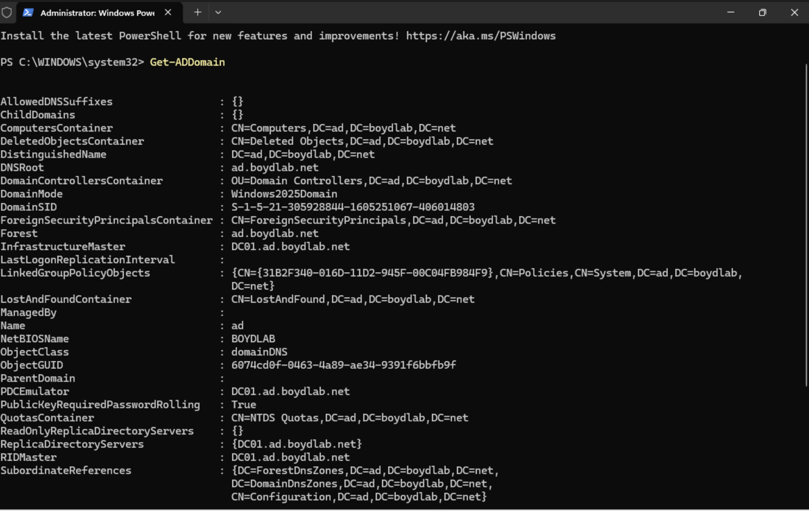

# Phase 1 — Domain Controller Promotion

**Goal:** Turn a fresh Windows Server 2025 install into the first domain controller of a
brand-new Active Directory forest, with integrated DNS.

---

## Key concepts (the "why" before the "how")

- **Domain** — a security and administrative boundary; a database of objects (users,
  computers, groups) sharing one authentication authority.
- **Forest** — the outermost security boundary, containing one or more domains. Creating the
  *first* domain necessarily creates the forest that holds it.
- **DNS** — how clients *find* domain controllers. DCs advertise their services (Kerberos,
  LDAP) as SRV records in DNS; a client with no path to the right DNS server cannot locate
  the domain at all. AD DS and DNS are tightly coupled, which is why promoting the first DC
  offers to install DNS automatically.
- **Role install vs. promotion** — installing the AD DS *role* only lays down the binaries
  and tools; the server *can* become a DC but isn't one yet. **Promotion** is the step that
  actually creates the domain, builds the directory database (`NTDS.dit`), and turns the box
  into a live authentication authority.

---

## Design decisions

**Domain name: `ad.boydlab.net` (not `.local`).**
Older tutorials use `company.local`. Current best practice is a **subdomain of a domain you
own** (`ad.boydlab.net`) because a routable namespace supports public TLS certificates and
clean **Entra ID Connect** hybrid-identity sync — `.local` complicates both. Since I'm coming
from the cloud side, keeping the on-prem namespace hybrid-friendly mattered.

**Hostname: `DC01`, set before promotion.**
Enterprise convention is role + number, ≤15 characters (NetBIOS limit). I renamed the server
*before* promoting because renaming a DC afterward is disruptive.

```powershell
Rename-Computer -NewName "DC01" -Restart
```

---

## Steps

1. **Install the AD DS role** — Server Manager → Manage → Add Roles and Features →
   Role-based install → select **Active Directory Domain Services** → accept the required
   management tools (AD DS snap-ins + AD PowerShell module).
2. **Promote to domain controller** — the post-install yellow flag → *Promote this server to
   a domain controller*.
   - Deployment operation: **Add a new forest** (nothing existed yet).
   - Root domain name: `ad.boydlab.net`.
   - DNS server: **enabled** (accepted the automatic install).
   - Global catalog: enabled (mandatory on the first DC).
   - NetBIOS name: overrode the auto-filled `AD` to **`BOYDLAB`** for a cleaner
     `BOYDLAB\user` logon format.
   - Set a DSRM (Directory Services Restore Mode) password — a *local* recovery credential
     used when AD itself is offline and normal domain logins won't work.
3. Ignored the expected **DNS delegation** warning (no real parent zone exists in an isolated
   lab).
4. Let the server reboot into the new domain.

---

## Verification

Confirmed the forest/domain via PowerShell rather than trusting the dashboard:

```powershell
Get-ADDomain
Get-ADForest
```

`Get-ADDomain` returned the expected values, including:

- `DNSRoot : ad.boydlab.net`
- `NetBIOSName : BOYDLAB`
- `DomainMode : Windows2025Domain`
- `InfrastructureMaster / PDCEmulator / RIDMaster : DC01.ad.boydlab.net` (all FSMO roles on
  the single DC)

Server Manager showed three role tiles: **AD DS**, **DNS** (installed during promotion), and
**File and Storage Services** (present by default).



*`Get-ADDomain` output confirming the forest/domain built correctly.*

---

## Troubleshooting note

`nslookup ad.boydlab.net` on the DC initially threw IPv6 (`::1`) timeouts before resolving
over IPv4. Fixed by pointing the DC's DNS client at its own IPv4 address explicitly:

```powershell
Set-DnsClientServerAddress -InterfaceAlias "Ethernet" -ResetServerAddresses
Set-DnsClientServerAddress -InterfaceAlias "Ethernet" -ServerAddresses 192.168.10.10
```

Forward resolution to `192.168.10.10` was the functional requirement and worked; the residual
`Server: UnKnown` line is a harmless reverse-lookup cosmetic (no reverse zone configured).
