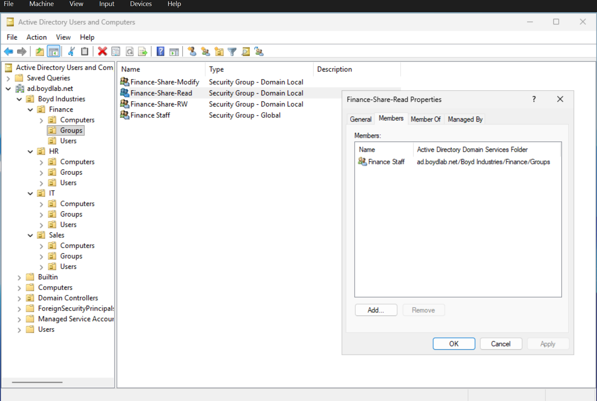

# Phase 3 — Users & the AGDLP Access Model

**Goal:** Create user accounts in the correct OUs and implement a group-based access model
using the **AGDLP** pattern — done in both ADUC and PowerShell.

---

## Key concepts — group scope

Two group *types* (Security vs. Distribution — I use Security, since Distribution is for email
only) and three *scopes*. The two that matter here:

- **Global group** — answers *"who is this?"* Groups users by **role/department**. Members come
  from its own domain; its membership is usable **forest-wide** as an identity unit. Think
  *job-title bucket.*
- **Domain Local group** — answers *"what can be accessed here?"* Represents access to a
  **specific resource**. Its permissions apply within its own domain. Think *door.*

A memorable framing: **Global = local members, forest-wide identity. Domain Local = forest-wide
members, local permission.** They're mirror images, which is why they pair cleanly.

## AGDLP

**A**ccounts → into **G**lobal groups → into **D**omain **L**ocal groups → which get
**P**ermissions.

> Put user accounts into global groups (by role); nest those global groups into domain local
> groups (by resource); assign the permission to the domain local group — never to users
> directly.

The payoff: you administer *people* on the global side and *resources* on the domain local
side, and the two never tangle. A new hire is added to one global group and inherits every
resource that group is nested into; offboarding is a single removal that closes every door at
once. One resource commonly has **multiple** domain local groups by access level
(e.g. `-Read`, `-RW`, `-FullControl`).

---

## Build

**Users** — created in the correct OU at creation time so they're immediately GPO-reachable.

GUI (ADUC): created Sarah Sales and Jim Jales directly in `Boyd Industries\Sales\Users`, with
lab-appropriate account options (*password never expires*, not *must change at next logon*,
account enabled).

PowerShell — created a Finance user with a **secure password prompt** rather than a plaintext
password in the script:

```powershell
New-ADUser -Name "Fiona Finance" -GivenName "Fiona" -Surname "Finance" `
  -SamAccountName "ffinance" -UserPrincipalName "ffinance@ad.boydlab.net" `
  -Path "OU=Users,OU=Finance,OU=Boyd Industries,DC=ad,DC=boydlab,DC=net" `
  -AccountPassword (Read-Host -AsSecureString "Enter password") `
  -Enabled $true -PasswordNeverExpires $true
```

**Global groups (identity)** — `Sales Staff` and `Finance Staff`, created in each department's
`Groups` OU. Example (PowerShell):

```powershell
New-ADGroup -Name "Finance Staff" -GroupScope Global -GroupCategory Security `
  -Path "OU=Groups,OU=Finance,OU=Boyd Industries,DC=ad,DC=boydlab,DC=net"

Add-ADGroupMember -Identity "Finance Staff" -Members "ffinance"
```

**Domain local group (resource / door)** — `Finance-Share-Read`, then **nested** the global
group inside it (the G→DL link — adding a *group* as a member of another group):

```powershell
New-ADGroup -Name "Finance-Share-Read" -GroupScope DomainLocal -GroupCategory Security `
  -Path "OU=Groups,OU=Finance,OU=Boyd Industries,DC=ad,DC=boydlab,DC=net"

Add-ADGroupMember -Identity "Finance-Share-Read" -Members "Finance Staff"
```

**Access tiers (multiple domain local groups per resource).** Because one resource commonly
needs more than one access level, I created three domain local groups for the Finance share —
`Finance-Share-Read`, `Finance-Share-RW`, and `Finance-Share-Modify` — each intended to be
granted a different permission level on the same folder. Different role (global) groups can
then be nested into whichever access tier fits, and the resource's ACL is set once and never
touched again. This demonstrates the pattern scaling beyond the minimal single-tier chain.

---

## Verification

Confirmed the nesting from both directions in ADUC:

- `Finance-Share-Read` → **Members** tab shows the **group** `Finance Staff` (not a user).
- `Finance Staff` → **Member Of** tab shows `Finance-Share-Read`.

The resulting chain: **Fiona → Finance Staff (global) → Finance-Share-Read (domain local)** —
so Fiona inherits access transitively without ever being added to the resource group directly.



*The `Finance-Share-Read` domain local group with the `Finance Staff` global group nested inside it (the G→DL link).*
