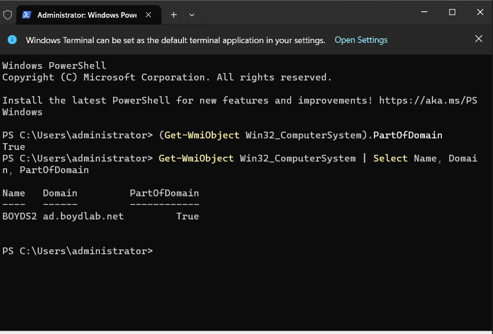

# Phase 5 — Client Domain Join & Authentication

**Goal:** Build a Windows 11 Pro client, put it on an isolated network with DC01, join it to
the domain, and authenticate a domain user on it — proving centralized identity works across
machines.

---

## Key concepts

- **A client finds its domain via DNS.** The single make-or-break requirement: the client's
  DNS server must be **the domain controller**, because only the DC knows the SRV records for
  `ad.boydlab.net`. Point a client at the wrong DNS server and the join fails with cryptic
  errors even though everything is "up." This is *the* classic beginner gotcha.
- **Windows 11 Home can't join a domain** — domain-join is a **Pro** feature. Used Windows 11
  **Pro** deliberately.
- **Static IPs, no DHCP** — on an isolated VirtualBox Internal Network there's no DHCP service,
  so both machines get static addresses configured by hand (good addressing practice).

---

## Networking setup

Both VMs set to VirtualBox **Internal Network** with the *same* network name (`intnet`) — the
matching name is what puts them on the same virtual switch. (Mismatched names silently isolate
them — a real gotcha.)

Addressing scheme (both `/24`, so they're on the same subnet and talk directly; no gateway
needed with no internet):

| Host | IP | DNS |
|---|---|---|
| DC01 | `192.168.10.10` | itself (`192.168.10.10`) |
| Client (BOYDS2) | `192.168.10.20` | **`192.168.10.10` (DC01)** |

Client configuration (PowerShell):

```powershell
New-NetIPAddress -InterfaceAlias "Ethernet" -IPAddress 192.168.10.20 -PrefixLength 24
Set-DnsClientServerAddress -InterfaceAlias "Ethernet" -ServerAddresses 192.168.10.10
```

---

## Verify BEFORE joining

Confirmed the client could resolve the domain *before* attempting the join — a failed
`nslookup` gives a clear answer, whereas a failed join gives a cryptic one:

```powershell
Get-NetIPConfiguration -InterfaceAlias "Ethernet"   # IP .20, DNS .10
nslookup ad.boydlab.net                             # resolves to 192.168.10.10
```

`nslookup` resolving `ad.boydlab.net → 192.168.10.10` was the green light — the client can find
the domain.

---

## Join

```powershell
Add-Computer -DomainName "ad.boydlab.net" -Credential (Get-Credential) -Restart
```

Supplied **domain admin** credentials (`BOYDLAB\Administrator`) in the prompt — required
because joining creates a computer object in AD.

**Verification** (rather than assuming the reboot meant success):

```powershell
(Get-WmiObject Win32_ComputerSystem).PartOfDomain          # True
Get-WmiObject Win32_ComputerSystem | Select Name, Domain, PartOfDomain
```

Returned `True` with `Domain : ad.boydlab.net`. On DC01, `Get-ADComputer -Filter *` showed
`BOYDS2` had landed in the default `Computers` container (the un-redirected default behavior
noted in Phase 2).



*`PartOfDomain : True` — the client (BOYDS2) confirmed as a domain member.*

---

## The payoff — cross-machine authentication

Logged into the client as domain user **`BOYDLAB\ffinance`** (Fiona) — an account that exists
*only* in the directory on DC01, with no local account on BOYDS2 — and reached her desktop.

This proves the whole point of AD: the client located the DC via **DNS**, the DC authenticated
her via **Kerberos**, and one centrally-stored identity worked on a separate machine. Fiona then
opened `\\DC01\FinanceShare` and could read (but not write) — the Phase 4 permissions holding up
over the network, end to end.

---

## Troubleshooting note

The Windows 11 OOBE repeatedly forced a Microsoft-account sign-in. Forced the local-account
path by dropping the network connection (`ipconfig /release` from a `Shift+F10` command prompt),
after which "limited setup / local account" became available. A domain-join lab wants a **local**
account initially — the machine is then joined to the domain, not tied to a personal MS account.
