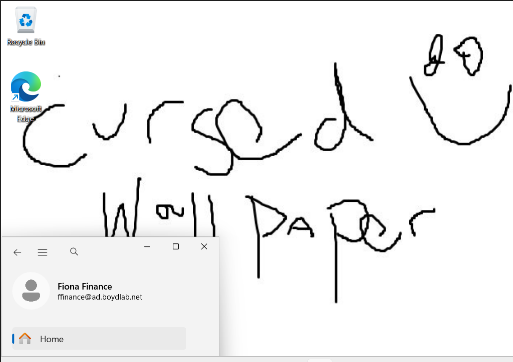
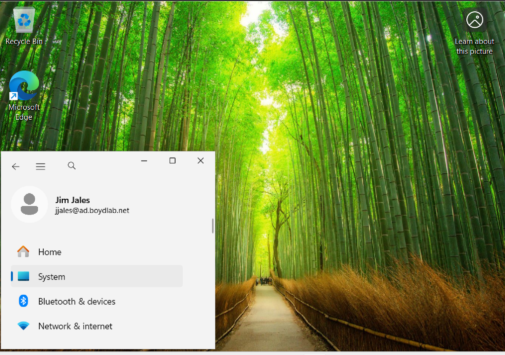

# Phase 6 — Group Policy

**Goal:** Create a Group Policy Object, link it to an OU, and confirm it applies to the right
users and *only* the right users — proving centralized, scoped configuration management.

---

## Key concepts

- **GPO vs. link** — a GPO is a container of settings; *linking* attaches it to a **site,
  domain, or OU**. Notably **not containers** — the reason the custom OU tree from Phase 2
  exists. Where you link determines *who it affects* (scope).
- **Two halves** — every GPO has a **Computer Configuration** (applies to computer objects at
  boot) and a **User Configuration** (applies to user objects at login). A wallpaper policy is
  User Configuration.
- **Link location = targeting.** A user-configuration policy only takes effect on user objects,
  so it must be linked to an OU that actually contains the target users. Linking it to a
  Computers OU would do nothing — a classic "right settings, wrong link location" failure.
- **Inheritance** — GPOs flow *down* the OU tree; a policy linked at `Boyd Industries` reaches
  everything beneath it, one linked at `Finance` reaches only Finance.
- **Refresh timing** — GPOs apply at startup/login and on a ~90-minute background refresh, or on
  demand with `gpupdate`. User settings apply most reliably at **login**.

---

## Build

Created and linked in one step in **Group Policy Management (GPMC)**: right-click
`Boyd Industries\Finance\Users` → *Create a GPO in this domain, and Link it here* →
**`Finance - Desktop Wallpaper`** (descriptive naming so the GPO's purpose is obvious).

Configured the setting via **Edit** → the Group Policy Management Editor:

```
User Configuration → Policies → Administrative Templates → Desktop → Desktop
    → "Desktop Wallpaper"  →  Enabled
```

**Asset staging (a key gotcha):** the wallpaper path must be reachable by the *client*, so a
local path like `C:\` won't work. Staged the image in **SYSVOL**, which replicates to every DC
and is reachable by all domain members over the network. Pointed the policy at the UNC path:

```
\\ad.boydlab.net\SYSVOL\ad.boydlab.net\scripts\finance-wallpaper.jpg
```

Verified the UNC path opened the image in File Explorer *before* trusting the policy.

---

## Verification — application AND scope

**Applied (in scope):** logged in as **Fiona** (Finance) → her desktop showed the policy
wallpaper. This is centrally-defined config, staged on the DC, pulled across the network by a
scoped user at login.

**Correctly NOT applied (out of scope):** logged in as **Jim** (Sales) on the *same* client →
default wallpaper. Because the GPO is linked to `Finance\Users` and Jim's account lives in
Sales, he's outside the scope and untouched.

The Fiona-gets-it / Jim-doesn't contrast — same machine, same GPO existing in the domain,
different result based purely on OU membership — proves correct **scope targeting**, not just
that a policy can apply. Testing the negative case is what separates "made a policy" from
"understands policy targeting," and it prevents the common real-world mistake of linking a GPO
too broadly.



*In scope — the GPO wallpaper applied to Fiona (Finance).*



*Out of scope — Jim (Sales) keeps the default wallpaper on the same client, proving correct scope targeting.*

---

## Concepts for extending this

- `gpupdate /force` to trigger a refresh without waiting for login/background cycle.
- `gpresult` to report exactly which GPOs applied to a user and diagnose when one doesn't — the
  #1 real-world Group Policy troubleshooting tool.
- A Computer-configuration GPO (e.g. USB or firewall policy) linked to a Computers OU to
  exercise the other half.
